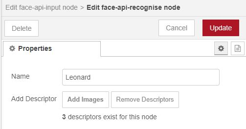

# node-red-contrib-face-recognition

[](https://www.npmjs.com/package/node-red-contrib-face-recognition)
[](https://www.npmjs.com/package/node-red-contrib-face-recognition)
[](https://www.npmjs.com/package/node-red-contrib-face-recognition)

## Version 2 Out Now!

Version 2.0.0 is now officially released brining performance increases, better useability, and more support across systems. Testing is still ongoing, so if you come across any bugs please open an issue or a discussion here.

## Overview

This node aims to wrap the epic [Face-API.js library](https://github.com/justadudewhohacks/face-api.js) from [justadudewhohacks](https://github.com/justadudewhohacks) into a simple to import and use node in Node-Red. If you like anything in this repo be sure to also check out the original.


Usage of this node is designed to be very easy while allowing the user to choose any number of options exposed by the original face-api.js module. These are currently;

- __Face detection__
- __Facial Landmarks__
- __Facial Expressions__
- __Age and Gender Predictions__
- __Facial Recognition__

This module also utilizes the `child_process` module of Node.js to offload the complex calculations required to a separate thread. In turn, the offloaded task will not block the main event loop and allow Node-Red to continue other tasks. Each input node spawns a new fork, which will consume memory, so this may want to be limited on resource restricted environments.

## Installation

From your `.node-red` directory, you can run;

``` bash
npm install node-red-contrib-face-recognition
```

or you can go to the pallette manager in Node-Red and find `node-red-contrib-face-recognition` in the install tab.

### Canvas

Canvas will be installed correctly providing when using either installation method, however the required packages need to be installed on the system. These are as follows for several common OS's;

#### Windows

No requirements

#### Mac

`¯\_(ツ)_/¯`

#### Linux (Debian Based)

``` bash
apt-get install -y python \
    g++ \
    build-essential \
    libcairo2-dev \
    libjpeg-dev
```

#### Official Docker Image

``` bash
apk add python \
    g++ \
    build-base \
    cairo-dev \
    jpeg-dev \
    pango-dev \
    musl-dev \
    giflib-dev \
    pixman-dev \
    pangomm-dev \
    libjpeg-turbo-dev \
    freetype-dev
```

### TensorFlow for Node.js (Optional)

You can also optionally install TensorFlow for Node.js to make this package run faster. If you do not, the node will still run albeit much slower. To install TensorFlow navigate to your `.node-red` folder and run the following command. This will install TensorFlow in your Node-Red directory for use by the node.

`npm install @tensorflow/tfjs-node`

> There are known issues with the working combinations version of Node.js, @tensorflow/tfjs-node and face-api.js. At the time of writing this, these were found to be;
> - Node.js: 10.16.3
> - @tensorflow/tfjs-node: 1.2.11
> - face-api.js: 0.21.0

> Please install these to gain the speed of the tf c++ backend and keep up to date on the face-api.js GitHib page for any errors relating to this.

tfjs-node is unfortunatley not supported on all OS's and all architectures. Below is a table of where they are supported;

|OS                      | x86 | armv7 | arm64v8 |
|------------------------|-----|-------|---------|
|Windows                 | yes | -     | -       |
|Mac                     | ?   | -     | ?       |
|Linux (Debian based)    | yes | no    | yes     |
|Official Docker Image   | no  | no    | no      |
|[Unofficial Docker Image](https://github.com/thebigpotatoe/node-red-docker) | yes! | soon    | yes!    |

## Example Flow

As an example on how to use the node, below is a flow that grabs an image from the internet and runs inference over it. Copy and paste it into Node-Red to use, but make sure to install the following nodes from the pallet manager;

- node-red-contrib-image-output

> Note: In order to recognise faces you will need to add the recognise config nodes yourself as these cannot be exported across instances.


``` JSON
[{"id":"c08c9d7b.c2377","type":"image","z":"4eb4b426.c9cfcc","name":"","width":"320","data":"payload","dataType":"msg","thumbnail":false,"pass":false,"outputs":0,"x":120,"y":100,"wires":[]},{"id":"461f82e0.80fc8c","type":"image","z":"4eb4b426.c9cfcc","name":"","width":"640","data":"payload.labelled_img","dataType":"msg","thumbnail":false,"pass":false,"outputs":0,"x":440,"y":100,"wires":[]},{"id":"453418e3.520f28","type":"face-api-input","z":"4eb4b426.c9cfcc","name":"TBBT Recognition","model":"SSD","confidence":50,"input_size":"128","landmarks":false,"expressions":true,"age_gender":true,"descriptors":true,"match_metric":"Mean Squared Error","match_confidence":"2500","recognise_nodes":["a88d60e.9ca13a","5d6c06f7.11d2c8","71bfb897.3b8ef8","e09c0d5.ca5acf","dc3c3afc.04e708","eb7ecb3c.a1cbb8","b4b62a6d.fc5c18"],"recognise_node_editor":"b4b62a6d.fc5c18","x":450,"y":40,"wires":[["461f82e0.80fc8c","4d4a98a1.c04008"]]},{"id":"d7b82011.6cfd1","type":"http request","z":"4eb4b426.c9cfcc","name":"TBBT","method":"GET","ret":"bin","paytoqs":"ignore","url":"https://www.etonline.com/sites/default/files/images/2019-05/bigbangtheory.jpg","tls":"","persist":false,"proxy":"","authType":"","x":230,"y":40,"wires":[["453418e3.520f28","c08c9d7b.c2377"]]},{"id":"492a9534.4d694c","type":"inject","z":"4eb4b426.c9cfcc","name":"","props":[{"p":"payload","v":"","vt":"str"},{"p":"topic","v":"","vt":"string"}],"repeat":"","crontab":"","once":false,"onceDelay":0.1,"topic":"","payload":"","payloadType":"str","x":90,"y":40,"wires":[["d7b82011.6cfd1"]]},{"id":"4d4a98a1.c04008","type":"debug","z":"4eb4b426.c9cfcc","name":"","active":true,"tosidebar":true,"console":false,"tostatus":false,"complete":"false","statusVal":"","statusType":"auto","x":650,"y":40,"wires":[]},{"id":"b4b62a6d.fc5c18","type":"face-api-recognise","name":"Leonard"}]
```

## Included Nodes

This module comes with two nodes; the `face-api-input` node and `face-api-recognise` node.

### Input node


#### Description

The `face-api-input` node is the main node that runs inference over an input image and optionally utilised recognition nodes to recognise faces. Each input node spawns a `fork` which is a seperate nodejs instance to run the recognition on to avoid blocking the main node-red event loop. This takes resources, be be conservative on resource constrained environments.

#### General Settings

- __Name__: The name of this specific node. Useful to change when you have multiple config nodes and need to know the difference between them. (defaults to "face-api-input")

#### Detection Settings

- __Detection Type__: The detection type to use. This is either `SSD` or `Yolo`, as `MTCNN` is not currently supported. (Defaults to SSD)

- __Input Size__: The input size of the Yolo algorithm. This option is only available when using Yolo as the type. (Defaults to 416)

- __Detection Confidence__: The minimum confidence score that each detected face much be above to be counted as a face. This option is available for both SSD and Yolo. (Defaults to 50%, Limited between 0 and 100)

- __Facial Landmarks__: Select this if you would like to add facial landmarks of each face to the output. (Defaults to false)

- __Facial Expressions__: Select this if you would like to add a prediction of facial expressions of each face to the output. (Defaults to false)

- __Age and Gender__: Select this if you would like to add a prediction of the age and gender of each face to the output. (Defaults to false)

- __Descriptors__: Select this if you would like to output the computed descriptors for each found face. (Defaults to false)

#### Recognition Settings

- __Recognition Metric__: Select the type of recognition metric to use when comparing faces with the recognition option. This is option is only shown when the recognise option is selected. (Defaults to Mean Squared Error)

- __Matched Confidence__: This is the minimum cutoff value for recognition for each of the metrics. Keep in mind that the different metrics will produce different ranges of values for recognition. This is option is only shown when the recognise option is selected. (Typical cutoffs are around 2000)

- __Recognise Nodes List__: A list of recognition nodes to run recognition against for each face found in an input image. Simply add and remove as many as required, there are no limits

- __Add/Edit Recognise Nodes__: Use this dropdown menu to add and edit new recognise nodes which you can then add to the input node list. Keep in mimd you will have to deploy the node before being able to find it in the list.

#### Compute Node



- __Name__: The name of this specific face to recognise. (defaults to "Unknown")

- __Add Images__: Use this button to add images to create a descriptors from. These descriptors will then be used in the input node to predict against an image. When adding images, the descriptors will take a while to compute.

- __Remove Descriptors__: Use this button to remove the currently stored descriptors. This is irreversible.

## Adding a face descriptor

In order to use the facial recognition, facial descriptors must be calculated first to allow a comparison between them and any input image. To do this, create a recognition node through the input node menu, then click `Add Images`. Once selected all images will be computed immediately in the background.

These descriptors are then saved to disk allowing it to survive restarts of Node-Red. The saved file will then be loaded on startup of Node-Red. Saving the descriptor is also safer than saving an image if your Node-Red instance is online as no data about the original image is stored.

## The Recognition Metric

The original Face-api.js library only supports the Euclidean distance method of comparison between descriptors when matching faces. To extend this, this node also supports 3 more type of metrics. These are; __Manhattan__, __Chebyshev__, and __Mean Squared Error__.

The outputs of these metrics from the node are all mapped roughly to the same output values of around 0 to 10000. This was to make it easier to compare the usefulness of each and allow the user to set a cutoff value within a similar range for each metric.

From testing, __Mean Squared Error__ gives the highest contrasting results from known to unknown faces. If you have another metric you feel may be useful, feel free to submit a pull request or create a discussion as I can now implement it along with the others.

## Contributing

If you like this node and want to contribute feel free to fork this repo and make a pull request. New features and suggestions are welcome, and there are several features I would like to implement, but lack the Javascript knowledge in Node.js. These are;

- [ ] Help on implementing tfjs-node on all platforms.
- [ ] General code improvements and clean ups
