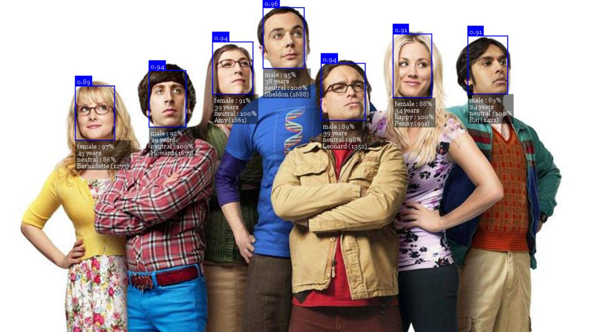

# node-red-contrib-face-recognition

This node aims to wrap the epic [Face-API.js library](https://github.com/justadudewhohacks/face-api.js) from [justadudewhohacks](https://github.com/justadudewhohacks) into a simple to import and use node in Node-Red. If you like anything in this repo be sure to also check out the original.



Usage of this node is designed to be very easy while allowing the user to choose any number of options exposed by the original face-api.js module. These are currently;

- Face detection
- Facial Landmarks
- Facial Expressions
- Age and Gender Predictions
- Facial Recognition

This module also utilises the `child_process` module of Node.js to offload the complex calculations required to a separate thread. In turn, the offloaded task will not block the main event loop and allow Node-Red to continue other tasks. This is entirely optional and up to the user to decide to allow for better management of resources on a constrained device such as the Raspberry Pi.

## Installation

From your .node-red directory, you can run;

`npm install node-red-contrib-face-recognition`

or you can go to the pallette manager in Node-Red and find `node-red-contrib-face-recognition` in the install tab.

## Example Flow

As an example on how to use the node, below is a flow that grabs an image from the internet and runs inference over it. Simply copy and paste it into Node-Red to use. 


```
[{"id":"ed949d24.97f4c","type":"inject","z":"424a261a.4eda88","name":"Input","topic":"","payload":"","payloadType":"date","repeat":"","crontab":"","once":false,"onceDelay":"","x":110,"y":60,"wires":[["e376be80.b379f"]]},{"id":"501d1e3.793b7e","type":"image","z":"424a261a.4eda88","name":"Labeled Image","width":"640","x":800,"y":160,"wires":[]},{"id":"7ce5390a.03bc08","type":"image","z":"424a261a.4eda88","name":"Input Image","width":"640","x":130,"y":160,"wires":[]},{"id":"375d57b5.151938","type":"face-api-input","z":"424a261a.4eda88","name":"Get Faces","computeNode":"b2fd7bf4.ed1248","x":450,"y":60,"wires":[["4a966d4f.e31e04","5db5c07f.d2f2e"]]},{"id":"4a966d4f.e31e04","type":"change","z":"424a261a.4eda88","name":"Set Payload to Image","rules":[{"t":"set","p":"payload","pt":"msg","to":"image","tot":"msg"}],"action":"","property":"","from":"","to":"","reg":false,"x":820,"y":120,"wires":[["501d1e3.793b7e"]]},{"id":"5db5c07f.d2f2e","type":"debug","z":"424a261a.4eda88","name":"Debug","active":true,"tosidebar":true,"console":false,"tostatus":false,"complete":"true","targetType":"full","x":770,"y":60,"wires":[]},{"id":"e376be80.b379f","type":"http request","z":"424a261a.4eda88","name":"Get Image","method":"GET","ret":"bin","paytoqs":false,"url":"https://thumbor.forbes.com/thumbor/960x0/https%3A%2F%2Fblogs-images.forbes.com%2Fmaddieberg%2Ffiles%2F2017%2F09%2Fbigbangtheorytv_s05e01_05-_h_2017.jpg","tls":"","proxy":"","authType":"basic","x":270,"y":60,"wires":[["375d57b5.151938","5aa0d77d.5108e8"]]},{"id":"5aa0d77d.5108e8","type":"base64","z":"424a261a.4eda88","name":"","action":"","property":"payload","x":120,"y":120,"wires":[["7ce5390a.03bc08"]]},{"id":"b2fd7bf4.ed1248","type":"face-api-compute","z":"","name":"TBB Faces","childHost":true,"recognitionType":"SSD","multipleFaces":"Multiple Faces","confidence":"50","inputSize":"416","landmarks":true,"expressions":true,"ageGender":true,"recognition":false,"labelName":"known","file":""}]
```
## TensorFlow for Node.js (Optional)

You can also optionally install TensorFlow for Node.js to make this package run faster. If you do not, the node will still run albeit much slower. To install TensorFlow navigate to your `.node-red` folder and run the following command. This will install TensorFlow in your Node-Red directory for use by the node.

`npm i face-api.js canvas @tensorflow/tfjs-node`

>It should be noted that there are issues with the installation of tfjs-node on windows and other machines due to unsupported versions of face-api.js. Please keep up to date on the face-api.js GitHib page for any errors relating to this.

## Included Nodes

This module comes with two nodes; the `face-api-input` node and `face-api-compute` node.

#### Input node


The `face-api-input` node acts as a pipeline between a flow and a selected compute node. A compute node must be created and selected for the input node to work. By using a config node based approach, multiple input nodes can share the same resources on your device allowing for a smaller memory footprint of the module.

By design, if a node is computing and another image is sent to that node, it will be ignored until the compute node has finished. This allows users to use a stream of images as an input and not worry about queued images bogging down the event loop.

#### Compute Node


The `face-api-compute` node is where all the options are set and calculations done. There are numerous options, so as a brief outline these are;

- __Node Name__: The name of this specific node. Useful to change when you have multiple config nodes and need to know the difference between them. (defaults to "face-api-compute")

- __Type__: The detection type to use. This is either `SSD` or `Yolo`, as `MTCNN` is not currently supported. (Defaults to SSD)

- __Detections__: The number of detections to calculate. Either all faces found as `"Multiple Faces"` or the highest confidence one as `"Single Face"`. (Defaults to Multiple)

- __Confidence__: The minimum confidence score that each detected face much be above to be counted as a face. This option is available for both SSD and Yolo. (Defaults to 50%, Limited between 0 and 100)

- __Input Size__: The input size of the Yolo algorithm. This option is only available when using Yolo as the type. (Defaults to 416)

- __Child Process__: Select if you would like to run the algorithm in a `child_process`. This will offload from the main event loop but use more resources. Use carefully. (Defaults to true)

- __Facial Landmarks__: Select this if you would like to add facial landmarks of each face to the output. (Defaults to false)

- __Facial Expressions__: Select this if you would like to add a prediction of facial expressions of each face to the output. (Defaults to false)

- __Age and Gender__: Select this if you would like to add a prediction of the age and gender of each face to the output. (Defaults to false)

- __Recognise__: Select this if you would like to try recognise each face in the output. This will require adding a descriptor by uploading an image using the supplied add image button. (Defaults to false)

- __Face Name__: The name of the face trying to be recognised. This is option is only shown when the recognise option is selected. (Defaults to "known")

- __Add Image__: Use this button to add an image to create a descriptor from. This descriptor will then be used in the compute node to predict against an input. This is option is only shown when the recognise option is selected.

#### Adding a face descriptor

In order to use the facial recognition option, a facial descriptor must be calculated first to allow a comparison between it and any input image. To do this, `enable recognition`, then click `Add Image`. Once an image has been selected it will be computed either on the next deploy if your node is new, or immediately if your node already exists.

This descriptor is then saved to disk allowing it to survive restarts of Node-Red. This saved file will then be loaded on startup of Node-Red. Saving the descriptor is also safer than saving an image if your Node-Red instance is online as no data about the original image is stored.

#### Using the Child_Process

As stated the compute node can offload the calculations to a `child_process` to allow the Node-Red event loop to continue. In doing this, another instance of Node.js is spawned which takes a certain amount of resources. Due to this it may not be desirable to run the calculations in this child node. With the option available, you can choose how to run this node for your specific application.

> It should be noted that the child node does not speed up the calculation. It only unblocks the main thread

## Contributing

If you like this node and want to contribute feel free to fork this repo and make a pull request. New features and suggestions are welcome, and there are several features I would like to implement, but lack the Javascript knowledge in Node.js. These are;

- [ ] Suppressing the tfjs-node warning when starting for those who wish to use tfjs-core only
- [ ] Convert `child_process` to a `worker_thread` for less memory usage.
- [ ] Help on implementing tfjs-node on all platforms.
- [ ] General code improvements and clean ups
